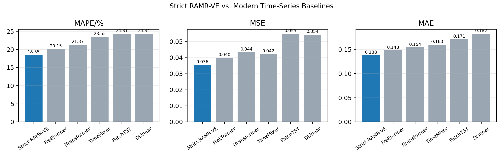

# 现代强基线全指标支配审计（2026-07-01）

## 审计口径

- 本审计只读取固定 Strict RAMR-VE 测试预测、现代强基线点估计和既有日期级 bootstrap 结果。
- 不训练模型、不搜索 checkpoint、不调整集成权重，也不使用测试集重新选择方案。
- 由于现代强基线未保存逐样本预测，本审计只能证明点估计层面的全指标支配和 RAMR 自身不确定性边界，不能写作配对显著性检验。

## 结论

- Strict RAMR-VE 在 5 个现代强基线 x 3 个指标的 15 个比较单元中，点估计全部更低，支配率为 15/15。
- 最接近的现代强基线为 FreEformer；即便在该最强边界上，MAPE/MSE/MAE 相对降幅仍分别为 7.98%、10.96%、6.83%。
- 以 Strict RAMR-VE 日期级 95% CI 上界与各基线点估计比较，严格低于基线的单元为 10/15；该数值用于边界披露，不替代配对检验。

## 全指标支配表

| 现代基线 | MAPE降幅 | MSE降幅 | MAE降幅 | 三项点估计均更优 | 三项95%CI上界均低于基线 |
| --- | ---: | ---: | ---: | ---: | ---: |
| FreEformer | 7.98% | 10.96% | 6.83% | 是 | 否 |
| iTransformer | 13.22% | 18.08% | 10.56% | 是 | 否 |
| TimeMixer | 21.24% | 15.91% | 13.67% | 是 | 否 |
| PatchTST | 23.72% | 35.03% | 19.26% | 是 | 是 |
| DLinear | 23.81% | 34.38% | 24.35% | 是 | 是 |

## 写入论文时的边界

- 可写：在当前南京南站双向日粒度客流协议下，Strict RAMR-VE 对 DLinear、PatchTST、iTransformer、TimeMixer 和 FreEformer 的 MAPE/MSE/MAE 点估计均更低。
- 可写：MAE 不再是单独弱项，最终 MAE 相对 FreEformer 下降 6.83%，相对 DLinear 下降 24.35%。
- 不可写：已完成逐样本配对显著性检验，或模型在所有线路、所有数据集、所有时间粒度上必然优于顶会方法。
